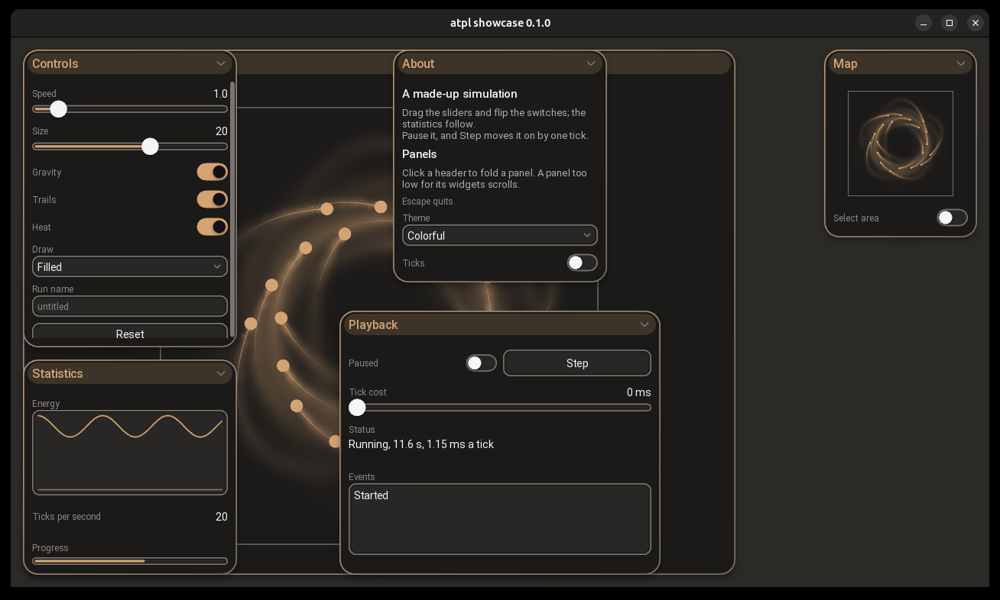
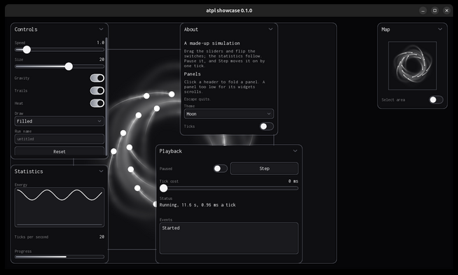

# SFMLAppTemplate

A template for SFML applications that show a simulation or an algorithm at work: AI training, pathfinding, raytracing, particle systems.

It provides a light, polished UI that is described in a few lines, linked to the application's data without glue code, and never slows the simulation down, plus the utilities such applications usually need.



> **Status: version 0.1.** Everything described here is built and tested. Linux is the supported platform; Windows (MSVC) is checked by an informational CI job. Starting a new project from the template is still being prepared (see the [project board](https://github.com/users/SvenSZim/projects/3)).

## Goals

- **Easy to set up**: a new application is a few dozen lines of declarative setup.
- **Light-weight**: the UI uses no more CPU, GPU or memory than necessary, and none while idle.
- **Polished**: rounded cards, shadows, animations, consistent themes.
- **Linked to your data**: a slider changes your parameter directly, safely across threads.
- **Built for simulations**: your rendering goes into views (background, panels, minimap); your simulation runs on its own thread.
- **Utilities included**: thread pool, random numbers, timing, grid, textures and quad batches.

## Quick start

You need CMake 3.28 or newer, a C++20 compiler (GCC 13 or Clang 18 or newer, both built and tested on every change; MSVC is checked too) and, on Linux, the development packages SFML's graphics module needs:

```
sudo apt install build-essential cmake git \
                 libx11-dev libxrandr-dev libxcursor-dev libxi-dev \
                 libudev-dev libgl1-mesa-dev libfreetype-dev
```

SFML 3 and Catch2 are downloaded by CMake while it configures; nothing else has to be installed.

```
git clone https://github.com/SvenSZim/SFMLAppTemplate.git
cd SFMLAppTemplate
cmake -S . -B build -DCMAKE_BUILD_TYPE=Release
cmake --build build --parallel
build/bin/showcase
```

The first build takes from about a minute to several, depending on the machine, since SFML is built from source. Then try:

- `build/bin/showcase`: every widget, a threaded particle simulation in a main view and a minimap. Drag the view, zoom with the wheel, switch the theme in the About panel, turn on Heat. `--layout dashboard` (or `overlay`, `cards`, `compact`) chooses another layout theme, `--profiler` shows what the UI costs, and Ctrl with plus, minus or 0 changes the GUI scale.
- `build/bin/starter`: the smallest application, the one explained below.
- `build/bin/particles`: 20,000 to 100,000 particles on all cores, in a layout of grid panels: they push each other apart, fall to the centre or down, and follow the attractors and repulsors you place; drawn plain, by speed, or as a density map.
- `build/bin/pathfinding`: breadth-first search, Dijkstra and A* finding their way through walls and mud, step by step on their own thread. Paint walls and mud with the left button, drag the start and the goal, try a maze.
- `ctest --test-dir build`: the tests. Some open a window for a moment; on a machine without a display, leave them out with `-LE display`.

## Your first application

`examples/starter/main.cpp` is the reference for how an application reads: a planet on an orbit, simulated on its own thread, two panels, a main view to drag and zoom, and a minimap. It is about 190 lines, half of them comments. Five steps:

**1. The data that is shared.** Values the user changes and the simulation reads are `Param`s: thread-safe, and a widget can be bound to them directly.

```cpp
struct Params {
    Param<float> speed = 1.f;
    Param<float> radius = 200.f;
    Param<bool> clockwise = true;
};
```

**2. The simulation.** It derives from `Simulation<State, Command>` and runs on its own thread at a fixed step. `tick` moves it on, `writeState` fills in what the main thread draws (at most once per frame, never half-written), and `onCommand` gets what the application `send`s.

```cpp
class Orbit final : public Simulation<World, Command> {
    void onCommand(const Command& command) override { if (command == Command::Reset) m_angle = 0.f; }
    void tick(float dt) override { m_angle += (m_params.clockwise ? 1.f : -1.f) * m_params.speed * dt; }
    void writeState(World& state) const override { /* the planet's position, the orbit's radius */ }
    ...
};
```

**3. The UI, described.** Panels, their place, their widgets, and what each widget is bound to. Nothing is laid out by hand; sizes and places come from the layout theme, and the look from the theme.

```cpp
App app({
    .window = {.title = "atpl starter"},
    .ui = {
        .background = "world", // a view behind all panels: the simulation fills the window
        .panels = {
            { .name = "Orbit", .placement = Anchor::TopLeft, .widgets = {
                Slider("Speed", params.speed, {.min = 0.0, .max = 5.0}),
                Slider("Radius", params.radius, {.min = 50.0, .max = 400.0}),
                Switch("Clockwise"), // bound by name, later
                Button("Reset"),
            } },
            { .name = "Simulation", .placement = Anchor::TopRight, .widgets = {
                Switch("Pause", simulation.controls.paused),
                ValueDisplay("Ticks per second", simulation.controls.ticksPerSecond, {.format = "{:.0f}"}),
            } },
            { .name = "Map", .placement = Anchor::BottomRight, .widgets = { View("minimap", {.height = 160.f}) } },
        },
    },
    .scale = AutoScale{}, // larger on a screen of high resolution
});
```

**4. Drawing.** A view is a place the application draws into with SFML, on the main thread. It reads the state of this frame; an optional `Camera` lets the user drag and zoom.

```cpp
app.ui().view("world").onDraw([&](sf::RenderTarget& target, sf::Vector2f size) {
    camera.apply(target, size);
    drawWorld(target, simulation.state());
});
```

**5. Events, and running.** Every button press, value change, key and pointer event arrives in one handler on the main thread. `run` opens the loop and the simulation's thread, and returns when the window closes.

```cpp
app.onEvent([&](const Event& event) {
    if (event.isButton("Reset")) simulation.send(Command::Reset);
    if (event.isKey(sf::Keyboard::Key::Escape)) app.quit();
    if (camera.handle(event)) app.ui().requestRedraw();
});
return app.run(simulation);
```

To start your own, copy the starter into `examples/` next to it, add it to `examples/CMakeLists.txt`, and change it from there. A dedicated way to start a new project from the template follows.

## The API at a glance

Everything is in namespace `atpl`; each name below is documented in the header named.

**Widgets** (`ui/widgets.hpp`). Each one is a descriptor in a panel's `widgets`, with a name, options, and optionally what it is bound to:

| Widget | Shows or edits | Binds to |
|---|---|---|
| `Button` | a push button; raises `ButtonPressed` | optionally a `Param<bool>` |
| `Switch` | on or off | `Param<bool>` |
| `Slider` | a number in a range, with optional steps | `Param` of a number |
| `Dropdown` | one of several entries | `Param` of an index or an enum |
| `TextInput` | a line of text | `Param<std::string>` |
| `ValueDisplay` | a number or text, formatted | `Param`, read-only |
| `ProgressBar` | how far a number is in a range | `Param` of a number |
| `Graph` | a curve of samples | `Series` or `PointSeries` |
| `Log` | the newest lines of a log | `TextLog` |
| `TextDisplay` | a block of changing text | `Param<std::string>` |
| `Paragraph` | static text: heading, body, footer | nothing |
| `View` | a place the application draws into | a draw function |

Widgets can also be bound after the setup (`ui.widget("Clockwise").bind(params.clockwise)`) or to functions of the application's own. An application can write widgets of its own; `tests/api/widget_usage.cpp` shows a complete one.

**Shared values** (`core/`): `Param<T>` for single values, `Series` and `PointSeries` for graphs, `TextLog` for logs. Any thread may write them; the UI picks changes up once per frame.

**The application** (`app/`): `App` (window, UI, main loop; `AppSetup`, `WindowSetup`), `Simulation<State, Command>` and its `controls` (pause, speed, single steps, ticks per second, all bindable), `Camera` (pan and zoom for a view), `Minimap` (a view that steers a camera), `Resources` (fonts and textures by name), `QuadBatch` (many sprites or cells in one draw call).

**The UI** (`ui/`): `UISetup` and `PanelSetup` (`setup.hpp`); `UI` (`ui.hpp`): find widgets, views and panels by name, switch theme, layout theme and GUI scale at runtime; `Event` (`event.hpp`): `isButton`, `changeOf`, `isKey`, `getIf<T>`.

**Looks**: a `Theme` (`theme.hpp`; `themes::moon()`, `themes::colorful()`) decides colours, shapes, fonts and animation times; part entries change single parts (`theme[Slider::Ticks].shown = true`). A `Layout` (`layout.hpp`; `layouts::overlay()`, `dashboard()`, `cards()`, `compact()`) decides sizes and where panels go. Both are plain values.

**Utilities** (`core/`): `ThreadPool` with `parallelFor`, `Random` and `RandomStreams` (the same numbers for a seed on every platform), `Stopwatch`, `Cooldown`, `RunningAverage`, `ScopedTimer`, `Grid<T>`.



## Building in detail

Binaries are placed in `build/bin/`. The build copies `resources/` to `build/bin/resources/`; applications look for their resources next to the executable, not in the working directory, so they can be started from anywhere.

`build/bin/atpl_render_bench` measures what the UI's rendering costs on a scene of 100 widgets, and `build/bin/atpl_responsiveness_bench` how the UI keeps its pace while every simulation tick takes a second; the results for the reference machine are in [docs/PROJECT_PLAN.md](docs/PROJECT_PLAN.md#55-targets-and-what-was-measured).

The setup API uses designated initializers that leave fields at their defaults (`{.min = 0, .max = 10}`). GCC and Clang warn about the omitted fields under `-Wextra`; linking `atpl::ui` switches that one warning off (`-Wno-missing-field-initializers`).

For editors and language servers, CMake writes `compile_commands.json` into the build directory and links it into the repository root (not on Windows).

| CMake option | Default | Effect |
|---|---|---|
| `ATPL_BUILD_TESTS` | `ON` | Build the unit tests |
| `ATPL_BUILD_EXAMPLES` | `ON` | Build the example applications |
| `ATPL_WARNINGS_AS_ERRORS` | `OFF` | Treat compiler warnings as errors |
| `ATPL_LINK_COMPILE_COMMANDS` | `ON` | Link `compile_commands.json` into the repository root |
| `ATPL_SANITIZE` | empty | Sanitizers for the template's own code, e.g. `address,undefined` or `thread` |

## Where to find what

| Path | Content |
|---|---|
| `include/atpl/core/`, `src/core/` | `atpl::core`: threading, shared values, timing, random numbers, grid. C++ standard library only |
| `include/atpl/ui/`, `src/ui/` | `atpl::ui`: panels, widgets, layout, input, themes, rendering. Needs SFML Graphics |
| `include/atpl/app/`, `src/app/` | `atpl::app`: window, main loop, simulation thread, camera, minimap, resources, quad batch |
| `examples/starter/`, `examples/particles/`, `examples/pathfinding/`, `examples/showcase/` | The example applications |
| `resources/` | Fonts and textures, copied next to the executables |
| `tests/` | Unit tests per library, display tests, the API usage examples, benchmarks |
| `tools/` | `format.sh` (clang-format), `make_particle_texture.py` |

Headers in `include/` are the public API; `src/` holds the implementation and internal headers.

## Documentation

| Document | Content |
|---|---|
| [docs/ARCHITECTURE.md](docs/ARCHITECTURE.md) | Structure, responsibilities, one frame step by step, what each header offers |
| [docs/LAYOUT.md](docs/LAYOUT.md) | How sizes and positions are decided: layout themes, top-down and bottom-up |
| [docs/PROJECT_PLAN.md](docs/PROJECT_PLAN.md) | Vision, requirements, decision log, roadmap, measurements |
| [docs/CODE_STYLE.md](docs/CODE_STYLE.md) | Code conventions |
| [CONTRIBUTING.md](CONTRIBUTING.md) | Workflow: issues, branches, commits, pull requests |

## License

MIT, see [LICENSE](LICENSE). Bundled third-party material (the Inconsolata and Roboto fonts) is listed in [THIRD_PARTY.md](THIRD_PARTY.md).
